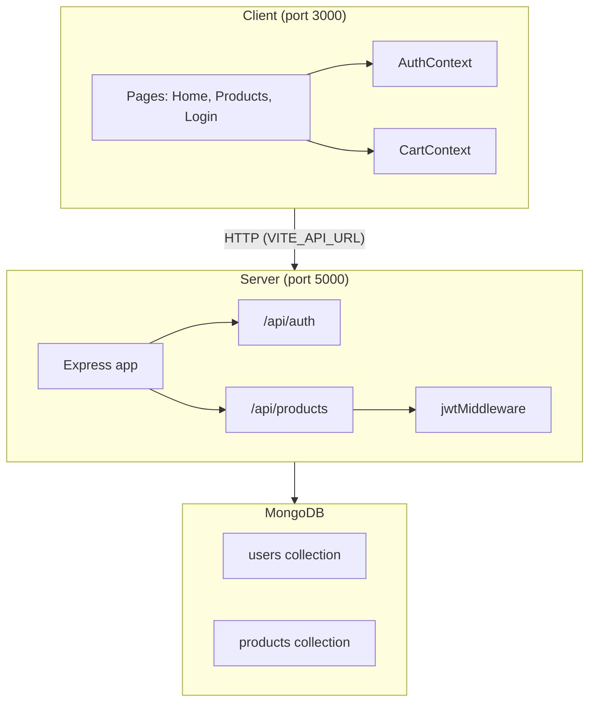

# ShopFlow

ShopFlow is a full-stack e-commerce application built as an npm workspaces monorepo. The React frontend handles browsing, authentication, and a client-side shopping cart; the Express API manages products, users, and JWT-protected admin operations backed by MongoDB.

The project is scaffolded with clear module boundaries and several features marked as TODO — product listing and auth are wired at the route/context level but not yet fully implemented end-to-end.

## Tech Stack

| Layer    | Technology                                |
| -------- | ----------------------------------------- |
| Frontend | React 19, TypeScript, Vite, React Router  |
| Backend  | Express 5, TypeScript, ts-node-dev        |
| Database | MongoDB via Mongoose                      |
| Auth     | JWT (`jsonwebtoken`) + bcryptjs (planned) |
| Monorepo | npm workspaces + `concurrently`           |

## Architecture



### Request flow

1. **Public reads** — The client fetches products from `GET /api/products` and `GET /api/products/:id` without authentication.
2. **Authentication** — Login posts credentials to `POST /api/auth/login`. On success, the server returns a JWT; the client stores it in `AuthContext` and sends it as `Authorization: Bearer <token>` on protected requests.
3. **Protected writes** — `POST`, `PATCH`, and `DELETE` on `/api/products` pass through `jwtMiddleware`, which verifies the token against `JWT_SECRET` and attaches `userId` to the request.
4. **Cart** — Cart state lives entirely in the browser via `CartContext` (in-memory, no server persistence yet).

### Backend layout

The server follows a layered structure per domain:

```
routes → service → model (Mongoose)
```

- **Auth** — `auth.routes.ts` → `auth.service.ts` → `users.service.ts` / `User` model
- **Products** — `products.routes.ts` → `products.service.ts` → `Product` model

Shared infrastructure lives in `config/db.ts` (MongoDB connection) and `auth/jwt.middleware.ts`.

### Frontend layout

- **Routing** — `AppRouter` defines `/`, `/products`, and `/login` inside a shared `Layout` shell (header, nav, cart badge).
- **State** — `AppProvider` wraps the app with `AuthProvider` and `CartProvider`.
- **API access** — The client reads the backend base URL from `VITE_API_URL` (see `ProductsPage`).

## Project Structure

```
shopflow/
├── package.json          # Root workspace scripts
├── client/
│   ├── src/
│   │   ├── components/   # Layout shell
│   │   ├── context/      # Auth + Cart providers
│   │   ├── pages/        # Home, Products, Login
│   │   └── routes/       # React Router config
│   ├── vite.config.ts
│   └── .env.local        # VITE_API_URL
└── server/
    ├── src/
    │   ├── auth/         # Login route, JWT middleware, DTOs
    │   ├── products/     # CRUD routes, service, model, DTOs
    │   ├── users/        # User model + lookup service
    │   ├── config/       # Database connection
    │   ├── app.ts        # Express app factory
    │   ├── main.ts       # Entry point
    │   └── seed.ts       # Database seed script
    └── .env              # PORT, MONGO_URI, JWT_SECRET
```

## Prerequisites

- **Node.js** 18+ (20 recommended)
- **npm** 9+
- **MongoDB** — local instance or MongoDB Atlas cluster

## Setup

### 1. Clone and install

```bash
git clone https://github.com/forexlord/shopflow
cd shopflow
npm install
```

This installs dependencies for both `client` and `server` workspaces from the root.

### 2. Configure environment variables

**Server** — create `server/.env`:

```env
PORT=5000
MONGO_URI=mongodb://localhost:27017/shopflow
JWT_SECRET=your_secret_key_here
```

| Variable     | Description                         |
| ------------ | ----------------------------------- |
| `PORT`       | API listen port (default `5000`)    |
| `MONGO_URI`  | MongoDB connection string           |
| `JWT_SECRET` | Secret used to sign and verify JWTs |

**Client** — create `client/.env.local`:

```env
VITE_API_URL=http://localhost:5000
```

| Variable       | Description                                     |
| -------------- | ----------------------------------------------- |
| `VITE_API_URL` | Base URL of the Express API (no trailing slash) |

### 3. Seed the database (optional)

```bash
npm run seed
```

The seed script connects to MongoDB and clears existing `Product` and `User` documents. Sample data insertion is not yet implemented.

### 4. Run in development

From the project root:

```bash
npm run dev
```

This starts both services concurrently:

| Service          | URL                   |
| ---------------- | --------------------- |
| Client (Vite)    | http://localhost:3000 |
| Server (Express) | http://localhost:5000 |

Verify the API with:

```bash
curl http://localhost:5000/health
# {"status":"ok"}
```

## Scripts

Run from the **repository root**:

| Command                | Description                                        |
| ---------------------- | -------------------------------------------------- |
| `npm run dev`          | Start client and server in watch mode              |
| `npm run build:client` | Type-check and build the Vite app to `client/dist` |
| `npm run build:server` | Compile server TypeScript to `server/dist`         |
| `npm run start:server` | Run the compiled server (`node dist/main.js`)      |
| `npm run seed`         | Run the database seed script                       |

Workspace-specific scripts are also available, e.g. `npm run dev --workspace=client`.

## API Reference

| Method   | Endpoint            | Auth | Status      |
| -------- | ------------------- | ---- | ----------- |
| `GET`    | `/health`           | —    | Implemented |
| `POST`   | `/api/auth/login`   | —    | Stub (501)  |
| `GET`    | `/api/products`     | —    | Implemented |
| `GET`    | `/api/products/:id` | —    | Implemented |
| `POST`   | `/api/products`     | JWT  | Stub (501)  |
| `PATCH`  | `/api/products/:id` | JWT  | Stub (501)  |
| `DELETE` | `/api/products/:id` | JWT  | Stub (501)  |

### Product schema

| Field         | Type   | Required         |
| ------------- | ------ | ---------------- |
| `name`        | string | yes              |
| `description` | string | yes              |
| `price`       | number | yes              |
| `imageUrl`    | string | no               |
| `category`    | string | no               |
| `stock`       | number | no (default `0`) |

### User schema

| Field      | Type   | Required     |
| ---------- | ------ | ------------ |
| `email`    | string | yes (unique) |
| `password` | string | yes          |
| `name`     | string | yes          |

## Production Build

```bash
npm run build:server
npm run build:client
```

1. Set production environment variables on the server host (`MONGO_URI`, `JWT_SECRET`, `PORT`).
2. Start the API: `npm run start:server`.
3. Serve `client/dist` with any static file host (Nginx, Vercel, Netlify, etc.), ensuring `VITE_API_URL` pointed to the production API **at build time**.

> **Note:** `VITE_*` variables are embedded during the client build. Rebuild the client if the API URL changes.

## Implementation Status

| Area                        | Status                                  |
| --------------------------- | --------------------------------------- |
| Monorepo + dev tooling      | Done                                    |
| MongoDB connection + models | Done                                    |
| Product read endpoints      | Done                                    |
| Product write endpoints     | Routes + middleware wired; service TODO |
| Auth login                  | Route wired; service + client TODO      |
| Client cart                 | In-memory state done                    |
| Client product listing      | Placeholder page                        |
| Database seed data          | Clears collections only                 |
