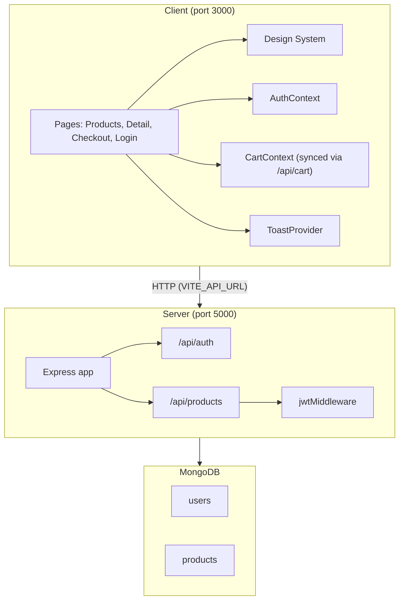

# ShopFlow

ShopFlow is a full-stack e-commerce application built as an npm workspaces monorepo. The React frontend provides product browsing, authentication, a per-user shopping cart, and a checkout flow; the Express API manages products, users, and JWT-protected admin operations backed by MongoDB.

## Features

- **Product catalog** — Search, category filters, price range, in-stock toggle, sort, grid/list views, and pagination
- **Product detail** — Image gallery, breadcrumbs, quantity stepper, and add-to-cart
- **Authentication** — Email/password login with JWT, session persistence, and protected routes
- **Shopping cart** — Per-user cart synced to the server (cross-browser), quantity controls, and header badge
- **Checkout** — Order summary with test purchase flow (spinner → success → cart cleared + toast)
- **Design system** — Shared tokens, atoms, and molecules used across all pages
- **Toast notifications** — Success and error feedback (API errors surface automatically)
- **Seed data** — 18 sample products and 2 demo users

## Tech Stack

| Layer        | Technology                               |
| ------------ | ---------------------------------------- |
| Frontend     | React 19, TypeScript, Vite, React Router |
| Styling      | CSS Modules + design tokens              |
| Backend      | Express 5, TypeScript, ts-node-dev       |
| Database     | MongoDB via Mongoose                     |
| Auth         | JWT (`jsonwebtoken`) + bcryptjs          |
| Monorepo     | npm workspaces + `concurrently`          |

## Architecture



### Request flow

1. **Public reads** — `GET /api/products`, `GET /api/products/:id`, and `GET /api/products/categories` require no authentication.
2. **Authentication** — `POST /api/auth/login` validates credentials with bcrypt and returns a JWT. The client stores the session in `localStorage` and sends `Authorization: Bearer <token>` on protected requests.
3. **Protected writes** — `POST`, `PATCH`, and `DELETE` on `/api/products` pass through `jwtMiddleware`, which verifies the token and attaches `userId` to the request.
4. **Cart** — Each user's cart is stored in MongoDB and accessed via JWT-protected `/api/cart` endpoints. The client syncs changes on login and debounces updates after each cart mutation, so the same cart appears on any browser or device.
5. **Errors** — Failed API responses trigger an error toast in the top-right corner via the shared `apiClient`.

### Backend layout

The server follows a layered structure per domain:

```
routes → service → model (Mongoose)
```

- **Auth** — `auth.routes.ts` → `auth.service.ts` → `users.service.ts` / `User` model
- **Products** — `products.routes.ts` → `products.service.ts` → `Product` model
- **Cart** — `cart.routes.ts` → `cart.service.ts` → `Cart` model

Shared infrastructure lives in `config/db.ts` (MongoDB connection) and `auth/jwt.middleware.ts`.

### Frontend layout

- **Routing** — `AppRouter` defines `/` (products), `/products/:productId`, `/checkout`, and `/login`. Authenticated pages share a `Layout` shell (`AppHeader`, `AppFooter`).
- **State** — `AppProvider` wraps `AuthProvider`, `CartProvider`, `ToastProvider`, and `ProductFiltersProvider`.
- **Features** — Domain logic lives under `features/` (`auth`, `products`, `cart`).
- **Design system** — Reusable UI in `design-system/` (tokens, atoms, molecules).
- **API** — `api/client.ts` centralizes fetch, error handling, and toast notifications.

## Project Structure

```
shopflow/
├── package.json              # Root workspace scripts
├── client/
│   ├── src/
│   │   ├── api/              # apiClient, auth/products API, toast bridge
│   │   ├── components/       # AppHeader, AppFooter, Layout
│   │   ├── context/          # Auth, Cart, Toast providers
│   │   ├── design-system/    # Tokens, atoms, molecules
│   │   ├── features/
│   │   │   ├── auth/         # Login form
│   │   │   ├── cart/         # Checkout view, cart items, storage
│   │   │   └── products/     # Filters, grid, detail, hooks
│   │   ├── pages/            # Products, Detail, Checkout, Login
│   │   └── routes/           # Router, ProtectedRoute, GuestRoute
│   ├── vite.config.ts
│   └── .env.local            # VITE_API_URL
└── server/
    ├── src/
    │   ├── auth/             # Login, JWT middleware, DTOs
    │   ├── cart/             # Per-user cart API, model
    │   ├── products/         # CRUD, query parser, mapper, model
    │   ├── users/            # User model + lookup service
    │   ├── seed/             # Seed data and runners
    │   ├── config/           # Database connection
    │   ├── app.ts            # Express app factory
    │   ├── main.ts           # Entry point
    │   └── seed.ts           # Database seed entry point
    └── .env                  # PORT, MONGO_URI, JWT_SECRET
```

## Prerequisites

- **Node.js** 18+ (20 recommended)
- **npm** 9+
- **MongoDB** — local instance or MongoDB Atlas cluster

## Setup

### 1. Clone and install

```bash
git clone https://github.com/forexlord/shopflow
cd shopflow
npm install
```

This installs dependencies for both `client` and `server` workspaces from the root.

### 2. Configure environment variables

**Server** — create `server/.env`:

```env
PORT=5000
MONGO_URI=mongodb://localhost:27017/shopflow
JWT_SECRET=your_secret_key_here
```

| Variable     | Description                         |
| ------------ | ----------------------------------- |
| `PORT`       | API listen port (default `5000`)    |
| `MONGO_URI`  | MongoDB connection string           |
| `JWT_SECRET` | Secret used to sign and verify JWTs |

**Client** — create `client/.env.local`:

```env
VITE_API_URL=http://localhost:5000
```

| Variable       | Description                                     |
| -------------- | ----------------------------------------------- |
| `VITE_API_URL` | Base URL of the Express API (no trailing slash) |

### 3. Seed the database

```bash
npm run seed
```

This clears and re-inserts seed data:

- **2 users** — `admin@shopflow.com`, `shopper@shopflow.com` (password: `password123`)
- **18 products** — across categories like Electronics, Footwear, Apparel, and Home

### 4. Run in development

From the project root:

```bash
npm run dev
```

| Service          | URL                   |
| ---------------- | --------------------- |
| Client (Vite)    | http://localhost:3000 |
| Server (Express) | http://localhost:5000 |

Verify the API:

```bash
curl http://localhost:5000/health
# {"status":"ok"}
```

### 5. Sign in

Open http://localhost:3000 — unauthenticated users are redirected to `/login`.

| Email                  | Password      | Role        |
| ---------------------- | ------------- | ----------- |
| `shopper@shopflow.com` | `password123` | Demo shopper |
| `admin@shopflow.com`   | `password123` | Admin user  |

After login, browse products, add items to your cart, and visit `/checkout` to review the order summary.

## Client Routes

| Path                  | Access    | Description                          |
| --------------------- | --------- | ------------------------------------ |
| `/login`              | Guest     | Sign-in form                         |
| `/`                   | Protected | Product catalog with filters         |
| `/products/:productId`| Protected | Product detail page                  |
| `/checkout`           | Protected | Cart and order summary               |

## Scripts

Run from the **repository root**:

| Command                | Description                                        |
| ---------------------- | -------------------------------------------------- |
| `npm run dev`          | Start client and server in watch mode              |
| `npm run build:client` | Type-check and build the Vite app to `client/dist` |
| `npm run build:server` | Compile server TypeScript to `server/dist`         |
| `npm run start:server` | Run the compiled server (`node dist/main.js`)      |
| `npm run seed`         | Seed users and products                            |

Workspace-specific scripts are also available, e.g. `npm run dev --workspace=client`.

## API Reference

| Method   | Endpoint                    | Auth | Description              |
| -------- | --------------------------- | ---- | ------------------------ |
| `GET`    | `/health`                   | —    | Health check             |
| `POST`   | `/api/auth/login`           | —    | Login, returns JWT       |
| `GET`    | `/api/products`             | —    | List products (filtered) |
| `GET`    | `/api/products/categories`  | —    | Distinct categories      |
| `GET`    | `/api/products/:id`         | —    | Single product           |
| `POST`   | `/api/products`             | JWT  | Create product           |
| `PATCH`  | `/api/products/:id`         | JWT  | Update product           |
| `DELETE` | `/api/products/:id`         | JWT  | Delete product           |
| `GET`    | `/api/cart`                 | JWT  | Get current user's cart  |
| `PUT`    | `/api/cart`                 | JWT  | Replace cart items       |
| `DELETE` | `/api/cart`                 | JWT  | Clear cart               |

### Product list query parameters

| Parameter     | Type     | Description                                      |
| ------------- | -------- | ------------------------------------------------ |
| `search`      | string   | Text search on name and description              |
| `categories`  | string   | Comma-separated category names                   |
| `minPrice`    | number   | Minimum price                                    |
| `maxPrice`    | number   | Maximum price                                    |
| `inStockOnly` | boolean  | `"true"` to exclude out-of-stock items           |
| `sort`        | string   | `newest`, `price-asc`, `price-desc`, or `popular`|
| `page`        | number   | Page number (1-based)                            |
| `limit`       | number   | Items per page                                   |

### Product schema

| Field         | Type   | Required         |
| ------------- | ------ | ---------------- |
| `name`        | string | yes              |
| `description` | string | yes              |
| `price`       | number | yes              |
| `imageUrl`    | string | no               |
| `category`    | string | no               |
| `stock`       | number | no (default `0`) |
| `popularity`  | number | no (default `0`) |

### User schema

| Field      | Type   | Required     |
| ---------- | ------ | ------------ |
| `email`    | string | yes (unique) |
| `password` | string | yes (hashed) |
| `name`     | string | yes          |

## Production Build

```bash
npm run build:server
npm run build:client
```

1. Set production environment variables on the server host (`MONGO_URI`, `JWT_SECRET`, `PORT`).
2. Start the API: `npm run start:server`.
3. Serve `client/dist` with any static file host (Nginx, Vercel, Netlify, etc.), ensuring `VITE_API_URL` pointed to the production API **at build time**.

> **Note:** `VITE_*` variables are embedded during the client build. Rebuild the client if the API URL changes.

## Implementation Status

| Area                         | Status                                      |
| ---------------------------- | ------------------------------------------- |
| Monorepo + dev tooling       | Done                                        |
| Design system                | Done                                        |
| MongoDB models + connection  | Done                                        |
| Auth (login, JWT, bcrypt)    | Done                                        |
| Product read/write API       | Done                                        |
| Database seed data           | Done (18 products, 2 users)                 |
| Product catalog UI           | Done                                        |
| Product detail UI            | Done                                        |
| Per-user cart + checkout UI  | Done (server-synced cart, test purchase flow) |
| Toast notifications        | Done                                        |
| Admin product management UI  | Not started (API available)                 |
| Real payment / orders API    | Not started                                 |
